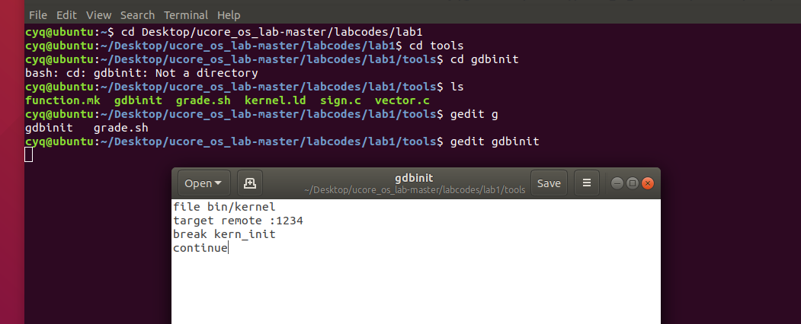
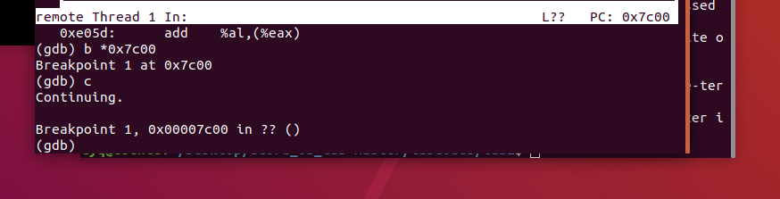

# 练习二：使用qemu执行并调试lab1中的软件。

为了熟悉使用qemu和gdb进行的调试工作，我们进行如下的小练习：

## 1、从CPU加电后执行的第一条指令开始，单步跟踪BIOS的执行。

（1）默认的gdb需要进行一些额外的配置才能进行qemu的调试任务，qemu和gdb之间使用网络端口1234进行通信。
 
（2）lab1/tools/gdbinit的内容如下。可见，这里是对内核代码进行调试，并且将断点设置在内核代码的入口地址，即kern_init函数：



为了从CPU加电后执行的第一条指令开始调试，修改lab1/tools/gdbinit，内容为：

（3） 通过上一个步骤gdb可以连接qemu，此时qemu会进入停止状态，听从gdb的命令。另外，可能需要qemu在一开始便进入等待模式，则不再使用make qemu开始系统的运行，而使用make debug来完成这项工作，并且将gdbinit中的'continue'指令删掉。这样qemu便不会在gdb未连接的时候擅自运行了。进入lab1的代码中，执行`make debug`命令，启动启动qemu和gdb开始调试：
使用'si'指令单步执行一条机器指令，实现单步跟踪BIOS：

##2、在初始化位置'0x7c00'设置实地址断点，测试断点正常：

再gdb中输入
```
	b *0x7c00//设置断点
	'c'//继续正在调试的程序
```
可以看到程序运行到0x7c00处停下来，但看不到当前汇编指令，可能是实验指导书中说的gdb与qemu不兼容：
##3、从0x7c00开始跟踪代码运行,将单步跟踪反汇编得到的代码与bootasm.S和 bootblock.asm进行比较。

在断点0x7c00处执行`x /10i $pc`查看汇编指令：可以看到指令与`bootasm.S`和`bootblock.asm`中的指令一致。
```
	   => 0x100000 <kern_init>:        push   %ebp
	   0x100001 <kern_init+1>:      mov    %esp,%ebp
	   0x100003 <kern_init+3>:      sub    $0x28,%esp
	   0x100006 <kern_init+6>:      mov    $0x10fd20,%edx
	   0x10000b <kern_init+11>:     mov    $0x10ea16,%eax
	   0x100010 <kern_init+16>:     sub    %eax,%edx
	   0x100012 <kern_init+18>:     mov    %edx,%eax
```
##4、自己找一个bootloader或内核中的代码位置，设置断点并进行测试。

修改gdbinit文件，在0x7c4a处设置断点 (调用bootmain函数处)：
输入 make debug ,得到结果：断点设置正常


