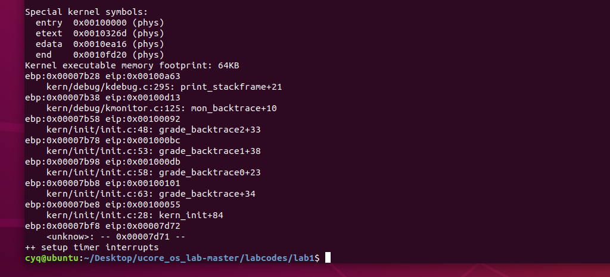
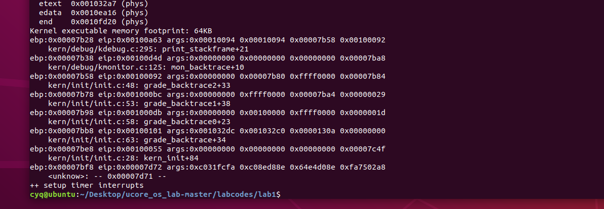

#练习5：实现函数调用堆栈跟踪函数 

1、中完成kdebug.c中函数print_stackframe的实现：

```

	1）首先定义两个局部变量ebp、esp分别存放ebp、esp寄存器的值。这里将ebp定义为指针，是为了方便后面取ebp寄存器的值。
	2）调用read_ebp函数来获取执行print_stackframe函数时ebp寄存器的值，这里read_ebp必须定义为inline函数，否则获取的是执行read_ebp函数时的ebp寄存器的值。
	3）调用read_eip函数来获取当前指令的位置，也就是此时eip寄存器的值。这里read_eip必须定义为常规函数而不是inline函数，因为这样的话在调用read_eip时会把当前指令的下一条指令的地址（也就是eip寄存器的值）压栈，那么在进入read_eip函数内部后便可以从栈中获取到调用前eip寄存器的值。
	4）由于变量eip存放的是下一条指令的地址，因此将变量eip的值减去1，得到的指令地址就属于当前指令的范围了。由于只要输入的地址属于当前指令的起始和结束位置之间，print_debuginfo都能搜索到当前指令，因此这里减去1即可。
	5）以后变量eip的值就不能再调用read_eip来获取了（每次调用获取的值都是相同的），而应该从ebp寄存器指向栈中的位置再往上一个单位中获取。
	6）由于ebp寄存器指向栈中的位置存放的是调用者的ebp寄存器的值，据此可以继续顺藤摸瓜，不断回溯，直到ebp寄存器的值变为0
```

按照函数中已经给出的注释完成函数：

```

	void
		print_stackframe(void) {
		     /* LAB1 YOUR CODE : STEP 1 */
			uint32_t ebp = read_ebp();
			uint32_t eip = read_eip();
			int i,j;
			for (j = 0; j < 4; j ++) {
            	cprintf("0x%08x ", args[j]); //打印4个参数
        	}
			for(i=0;i<STACKFRAME_DEPTH;i++){
				while(ebp){//由于ebp寄存器指向栈中的位置存放的是调用者的ebp寄存器的值，据此可以继续顺藤摸瓜，不断回溯，直到ebp寄存器的值变为0
					cprintf("ebp:0x%08x eip:0x%08x",ebp,eip);
					uint32_t *args=(uint32_t *)ebp+2;
					cprintf("\n");
					print_debuginfo(eip-1);
					eip = ((uint32_t *)ebp)[1];
					ebp = ((uint32_t *)ebp)[0];//最后更新ebp：ebp=ebp[0],更新eip：eip=ebp[1]，因为ebp[0]=ebp，ebp[1]=ebp[0]+4=eip。
				}
			}
		     /* (1) call read_ebp() to get the value of ebp. the type is (uint32_t);//调用read_edp()得到当前edp的值
		      * (2) call read_eip() to get the value of eip. the type is (uint32_t);//调用read_eip()得到当前eip的值
		      * (3) from 0 .. STACKFRAME_DEPTH
		      *    (3.1) printf value of ebp, eip
		      *    (3.2) (uint32_t)calling arguments [0..4] = the contents in address (uint32_t)ebp +2 [0..4]
		      *    (3.3) cprintf("\n");
		      *    (3.4) call print_debuginfo(eip-1) to print the C calling function name and line number, etc.
		      *    (3.5) popup a calling stackframe
		      *           NOTICE: the calling funciton's return addr eip  = ss:[ebp+4]
		      *                   the calling funciton's ebp = ss:[ebp]
		      */
		}
```

先开始写函数的时候没有打印参数，结果执行`make qemu`后，输出结果与指导书上不一样，然后对了答案发现是参数没有打印，就修改了代码，修改成现在上面这样(源文件里面没写中文注释，所以把代码又粘在了这里)


修改完之后再`make qemu`结果就正常了：


```

	ebp:0x00007b28 eip:0x00100a63 args:0x00010094 0x00010094 0x00007b58 0x00100092 
	    kern/debug/kdebug.c:295: print_stackframe+21
	ebp:0x00007b38 eip:0x00100d4d args:0x00000000 0x00000000 0x00000000 0x00007ba8 
	    kern/debug/kmonitor.c:125: mon_backtrace+10
	ebp:0x00007b58 eip:0x00100092 args:0x00000000 0x00007b80 0xffff0000 0x00007b84 
	    kern/init/init.c:48: grade_backtrace2+33
	ebp:0x00007b78 eip:0x001000bc args:0x00000000 0xffff0000 0x00007ba4 0x00000029 
	    kern/init/init.c:53: grade_backtrace1+38
	ebp:0x00007b98 eip:0x001000db args:0x00000000 0x00100000 0xffff0000 0x0000001d 
	    kern/init/init.c:58: grade_backtrace0+23
	ebp:0x00007bb8 eip:0x00100101 args:0x001032dc 0x001032c0 0x0000130a 0x00000000 
	    kern/init/init.c:63: grade_backtrace+34
	ebp:0x00007be8 eip:0x00100055 args:0x00000000 0x00000000 0x00000000 0x00007c4f 
	    kern/init/init.c:28: kern_init+84
	ebp:0x00007bf8 eip:0x00007d72 args:0xc031fcfa 0xc08ed88e 0x64e4d08e 0xfa7502a8 
	    <unknow>: -- 0x00007d71 --
	++ setup timer interrupts

```

解释最后一行各个数值的含义：

最后一行为`ebp:0x00007bf8 eip:0x00007d72 args:0xc031fcfa 0xc08ed88e 0x64e4d08e 0xfa7502a8 `，共有ebp，eip和args三类参数，下面分别给出解释：

1）`ebp:0x0007bf8` 此时`ebp`的值是`kern_init`函数的栈顶地址，从`obj/bootblock.asm`文件中知道整个栈的栈顶地址为`0x00007c00`，`ebp`指向的栈位置存放调用者的ebp寄存器的值，`ebp+4`指向的栈位置存放返回地址的值，这意味着kern_init函数的调用者（也就是`bootmain`函数）没有传递任何输入参数给它！因为单是存放旧的`ebp`、返回地址已经占用8字节了。

2)`eip:0x00007d72` `eip`的值是`kern_init`函数的返回地址，也就是`bootmain`函数调用`kern_init`对应的指令的下一条指令的地址。这与`obj/bootblock.asm`是相符合的。

```

	7d72:	ba 00 8a ff ff       	mov    $0xffff8a00,%edx
	7d77:	89 d0                	mov    %edx,%eax
```

3)`args:0xc031fcfa 0xc08ed88e 0x64e4d08e 0xfa7502a8 ` 一般来说，`args`存放的4个dword是对应4个输入参数的值。但这里比较特殊，由于`bootmain`函数调用`kern_init`并没传递任何输入参数，并且栈顶的位置恰好在`boot loader`第一条指令存放的地址的上面，而`args`恰好是`kern_int`的`ebp`寄存器指向的栈顶往上第2~5个单元，因此`args`存放的就是`boot loader`指令的前16个字节！可以对比`obj/bootblock.asm`文件来验证（验证时要注意系统是小端字节序）。

```

	00007c00 <start>:
	
	# start address should be 0:7c00, in real mode, the beginning address of the running bootloader
	.globl start
	start:
	.code16                                             # Assemble for 16-bit mode
	    cli                                             # Disable interrupts
	    7c00:	fa                   	cli    
	    cld                                             # String operations increment
	    7c01:	fc                   	cld    
	
	    # Set up the important data segment registers (DS, ES, SS).
	    xorw %ax, %ax                                   # Segment number zero
	    7c02:	31 c0                	xor    %eax,%eax
	    movw %ax, %ds                                   # -> Data Segment
	    7c04:	8e d8                	mov    %eax,%ds
	    movw %ax, %es                                   # -> Extra Segment
	    7c06:	8e c0                	mov    %eax,%es
	    movw %ax, %ss                                   # -> Stack Segment
	    7c08:	8e d0                	mov    %eax,%ss
	
	00007c0a <seta20.1>:
	# Enable A20:
	    #  For backwards compatibility with the earliest PCs, physical
	    #  address line 20 is tied low, so that addresses higher than
	    #  1MB wrap around to zero by default. This code undoes this.
	seta20.1:
	    inb $0x64, %al                                  # Wait for not busy(8042 input buffer empty).
	    7c0a:	e4 64                	in     $0x64,%al
	    testb $0x2, %al
	    7c0c:	a8 02                	test   $0x2,%al
	    jnz seta20.1
	    7c0e:	75 fa                	jne    7c0a <seta20.1>
```
