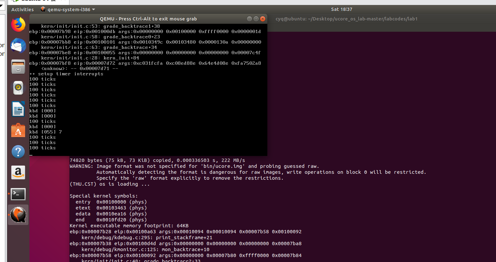

# 练习6：完善中断初始化和处理

## 中断描述符表（也可简称为保护模式下的中断向量表）中一个表项占多少字节？其中哪几位代表中断处理代码的入口？

首先在`lab1/kern/mm/mmu.h`中查看一个表项的结构如下：

```

	/* Gate descriptors for interrupts and traps */
	struct gatedesc {
	    unsigned gd_off_15_0 : 16;        // low 16 bits of offset in segment
	    unsigned gd_ss : 16;            // segment selector
	    unsigned gd_args : 5;            // # args, 0 for interrupt/trap gates
	    unsigned gd_rsv1 : 3;            // reserved(should be zero I guess)
	    unsigned gd_type : 4;            // type(STS_{TG,IG32,TG32})
	    unsigned gd_s : 1;                // must be 0 (system)
	    unsigned gd_dpl : 2;            // descriptor(meaning new) privilege level
	    unsigned gd_p : 1;                // Present
	    unsigned gd_off_31_16 : 16;        // high bits of offset in segment
	};
```

由代码可知，中断描述符表一个表项占8个字节，结构如下：

```

	1、bit 0-15：offest
	2、bit 16-31：Segment selector
	3、bit 32-47：属性信息，包括DPL、P flag等
	4、bit 48-63：offest
```

其中第16-32位是段选择子，用于索引全局描述符表GDT来获取中断处理代码对应的段地址，再加上第0-15、48-63位构成的偏移地址，即可得到中断处理代码的入口。

## 编程完善kern/trap/trap.c中对中断向量表进行初始化的函数idt_init：

这个不是很懂，不太会写，参考了网上的资料(https://www.cnblogs.com/wuhualong/p/ucore_lab1_exercise6_report.html)：

1、题目已经提供中断向量的门类型和DPL的设置方法：除了系统调用的门类型为陷阱门、`DPL=3`外，其他中断的门类型均为中断门、`DPL`均为0.

2、中断处理函数的段选择子及偏移量的设置要参考`kern/trap/vectors.S`文件：由该文件可知，所有中断向量的中断处理函数地址均保存在`__vectors`数组中，该数组中第i个元素对应第i个中断向量的中断处理函数地址。而且由文件开头可知，中断处理函数属于.text的内容。因此，中断处理函数的段选择子即`.text`的段选择子`GD_KTEXT`。从`kern/mm/pmm.c`可知`.text`的段基址为0，因此中断处理函数地址的偏移量等于其地址本身。

3、完成`IDT`表的初始化后，还要使用`lidt`命令将`IDT`表的起始地址加载到`IDTR`寄存器中。


```

	/* idt_init - initialize IDT to each of the entry points in kern/trap/vectors.S */
	void
	idt_init(void) {
	    extern uintptr_t __vectors[];//保存在vectors.S中的256个中断处理例程的入口地址数组
	    int i;
		//使用SETGATE宏，对中断描述符表中的每一个表项进行设置
	    for (i = 0; i < sizeof(idt) / sizeof(struct gatedesc); i ++) {//IDT表项的个数
		//在中断门描述符表中通过建立中断门描述符，其中存储了中断处理例程的代码段GD_KTEXT和偏移量__vectors[i]，特权级为DPL_KERNEL。这样通过查询idt[i]就可定位到中断服务例程的起始地址。
	        SETGATE(idt[i], 0, GD_KTEXT, __vectors[i], DPL_KERNEL);
	    }
	    // set for switch from user to kernel
	    SETGATE(idt[T_SWITCH_TOK], 0, GD_KTEXT, __vectors[T_SWITCH_TOK], DPL_USER);
	    // load the IDT
		//建立好中断门描述符表后，通过指令lidt把中断门描述符表的起始地址装入IDTR寄存器中，从而完成中段描述符表的初始化工作。
	    lidt(&idt_pd);
	     /* LAB1 YOUR CODE : STEP 2 */
	     /* (1) Where are the entry addrs of each Interrupt Service Routine (ISR)?
	      *     All ISR's entry addrs are stored in __vectors. where is uintptr_t __vectors[] ?
	      *     __vectors[] is in kern/trap/vector.S which is produced by tools/vector.c
	      *     (try "make" command in lab1, then you will find vector.S in kern/trap DIR)
	      *     You can use  "extern uintptr_t __vectors[];" to define this extern variable which will be used later.
	      * (2) Now you should setup the entries of ISR in Interrupt Description Table (IDT).
	      *     Can you see idt[256] in this file? Yes, it's IDT! you can use SETGATE macro to setup each item of IDT
	      * (3) After setup the contents of IDT, you will let CPU know where is the IDT by using 'lidt' instruction.
	      *     You don't know the meaning of this instruction? just google it! and check the libs/x86.h to know more.
	      *     Notice: the argument of lidt is idt_pd. try to find it!
	      */
	}
```

代码中SETGATE函数的实现：
```

	//lab1/kern/mm/mmu.h
	#define SETGATE(gate, istrap, sel, off, dpl) {            \
	    (gate).gd_off_15_0 = (uint32_t)(off) & 0xffff;        \
	    (gate).gd_ss = (sel);                                \
	    (gate).gd_args = 0;                                    \
	    (gate).gd_rsv1 = 0;                                    \
	    (gate).gd_type = (istrap) ? STS_TG32 : STS_IG32;    \
	    (gate).gd_s = 0;                                    \
	    (gate).gd_dpl = (dpl);                                \
	    (gate).gd_p = 1;                                    \
	    (gate).gd_off_31_16 = (uint32_t)(off) >> 16;        \
	}
```
```

	gate：为相应的idt数组内容
	sel：段选择子
	sel：段选择子
	dpl：设置优先级
```
宏定义和数组说明：

```

	#define GD_KTEXT    ((SEG_KTEXT) << 3)        // kernel text
	#define DPL_KERNEL    (0)
	#define DPL_USER    (3)
	#define T_SWITCH_TOK                121    // user/kernel switch
	static struct gatedesc idt[256] = {{0}};
```

## 编程完善trap.c中的中断处理函数trap，在对时钟中断进行处理的部分填写trap函数中处理时钟中断的部分，使操作系统每遇到100次时钟中断后，调用print_ticks子程序，向屏幕上打印一行文字”100 ticks”

trap函数只是直接调用了trap_dispatch函数，而trap_dispatch函数实现对各种中断的处理，题目要求我们完成对时钟中断的处理，实现非常简单：定义一个全局变量ticks，每次时钟中断将ticks加1，加到100后打印"100 ticks"，然后将ticks清零重新计数。代码实现如下：

```

	ticks ++;
    if (ticks % TICK_NUM == 0) {//在一个定时器中断之后，应该使用一个全局变量来记录这个事件(增加它)，例如kern/driver/clock.c中的ticks.在每个TICK_NUM循环中，可以使用print_ticks()函数打印一些信息。
	    print_ticks();
    }
    break;
```

执行结果如下：
